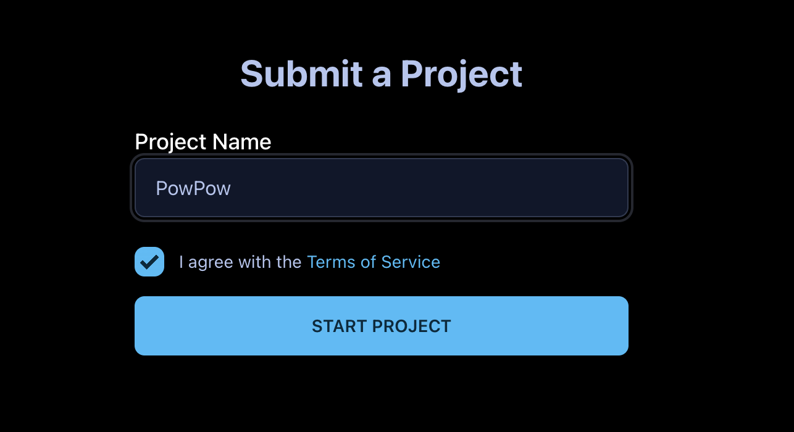
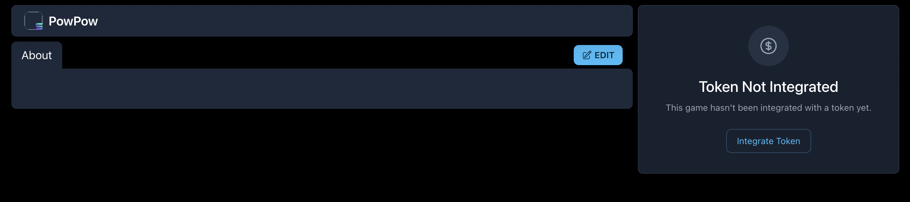

# How It Works

Welcome to Indie.fun, where you can launch your Projects and use any coin as its currency. This guide will walk you through the process of creating and managing your project.

## 1. Create Your Project

Start by clicking the "Submit a Project" button. You'll be prompted to enter your project name and agree to our terms of service. This simple process kickstarts your journey on Indie.fun.

## 2. Project Creation Success

Congratulations! Your project has been created. To add project information, click the edit button.

## 3. Project Configuration

The edit interface contains seven tabs for comprehensive project management:

### General

- Edit project URL and name
- Add project description
- Connect Trench game
- Upload project poster

### Media

- Add YouTube video links
- Upload project images and screenshots
- Manage visual content

### Social

- Add social media links (X, Discord, Telegram)
- Include website URL
- Connect your community

### Token

- Launch a new token or use an existing one
- For new tokens, set up fundraising parameters and token distribution
- For existing tokens, your project will immediately show a trading interface
- Sign contract and pay fees (0.02 SOL platform fee + Solana account fees)

- [Learn more about token creation and fundraising →](token-creation.md)

### Whitelist Management

- Manage pre-launch access for whitelisted wallets
- Set whitelist backing amounts
- Control early access permissions

### Notifications

- Send updates to project followers
- Keep your community informed
- Manage communication preferences

### Leaderboard

- Connect with bountyhunt.fun
- Create new competitions
- Engage with the community

## 4. Complete Your Project

Once you've filled in all the necessary details about your project:

- Configure your token settings (new or existing)
- Review all information for accuracy
- Click "Publish" in the General tab to make your project live

