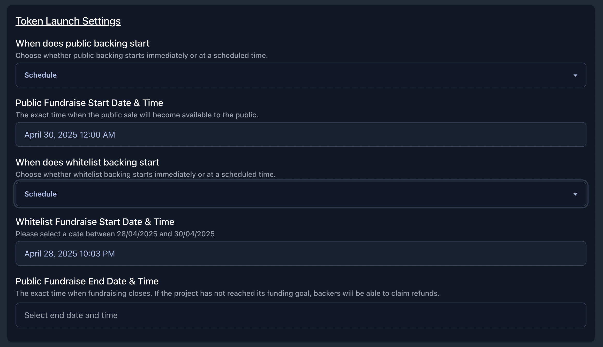

# Token Creation & Fundraising

This guide explains how to create and launch a token for your project on Indie.fun.

## Token Integration

The first step is to select your token integration method. You have two options:

1. **Create a new token** - Start a fundraising campaign with a newly created token
2. **Select an existing token** - Use a token you've already created elsewhere

---

## Using an Existing Token

If you already have a token on Solana that you want to use for your project, you can integrate it directly without going through the token creation process.

### Steps to Integrate an Existing Token

1. Select "Select an existing Token" from the dropdown menu
2. Enter your token's contract address in the field provided
3. Click "Verify Token" to validate the token exists and you have the necessary permissions
4. Review the submission fee notice (0.02 SOL non-refundable fee)
5. Click "Integrate Token" to add the token to your project

Once integrated, your existing token will be available for trading on the platform immediately, without needing to go through the fundraising process.

---

## Creating a New Token

If you choose to create a new token, the process is divided into four main parts. Let's walk through them:

### 1. Token Allocation & Distribution

#### Token Standard Selection

You'll first need to select the token standard for your new token:

- **SPL Token Standard** - The original Solana token standard, providing basic functionality for creating and managing tokens
- **Token-2022** - An improved token standard with enhanced features and programmability

#### Funding Goal

Set the amount of SOL you want to raise for your project. For example, if you set a funding goal of 100 SOL:

#### Creator Token Allocation

Configure how your project's tokens will be distributed:

- **You Receive**: Percentage of total token supply you'll receive (0-80%)
- **Liquidity Pool**: Portion allocated to the liquidity pool
- **Backers**: Tokens distributed to project backers

The system will automatically calculate and display the token distribution based on your settings, showing both percentages and actual token amounts.

#### Creator SOL Allocation

Use the slider to determine how the raised SOL will be distributed upon successful fundraising:

- **You Receive**: The percentage of the fundraised amount you'll receive directly (e.g., 57% = 57 SOL from 100 SOL)
- **Liquidity Pool**: The portion that will be used to create a trading pool for your token (e.g., 33% = 33 SOL from 100 SOL)
- **Platform Fee**: Fixed at 10% of the total raised (10 SOL from 100 SOL)

#### Price Volatility Indicator

The system will analyze your settings and show potential price volatility metrics:

- Token dump impact: Estimates the effect on price if 1% of your token supply (e.g., 10M tokens) were sold at once
- Buying pressure analysis: Shows the projected price change from purchasing 1 SOL worth of tokens
- Volatility Score: Provides a summary of how volatile your token's price may be based on current settings

These insights are informational only and intended to help you assess the volatility of your token distribution and trading setup.

---

### 2. Token Launch Settings

Configure when and how your fundraising campaign will begin and end.

#### Public Backing Start

Choose when your project will be open for public investment:

- **Immediate** - Fundraising begins as soon as you mint your token
- **Schedule** - Set a specific date and time for public backing to begin

If you select "Schedule," you'll be prompted to select the exact date and time when your project will be publicly available for backing.

#### Whitelist Backing Start

Before opening to the public, you can allow selected wallets to participate in an early backing phase:

- **Immediate** - Whitelisted wallets can back your project immediately after token is minted
- **Schedule** - Set a specific date and time for whitelist backing to begin

> To manage who gets whitelist access and how much they can contribute, visit the [Whitelist Management](#) tab in your project settings.

#### Public Fundraise End Date & Time

Set when your fundraising campaign will close. This must be within 30 days of the public backing start date.

**Important:** If your project doesn't reach its funding goal by the end date, backers can reclaim their SOL by returning their tokens.

---

### 3. Token Details

Here, you define the basic information about your token that will be displayed to users.

#### Token Name

Enter a name for your token that represents your project. This is the full name that will be displayed on exchanges and in wallets (e.g., "Bounty").

#### Token Ticker

Create a short symbol for your token, typically 3-5 characters. This will be used as your token's trading symbol on exchanges and in wallets (e.g., "BNTY").

#### Token Image

Upload an image that will serve as your token's logo. This image will be displayed next to your token on the platform, in wallets, and on exchanges.

- Drag and drop an image or click to select a file
- Maximum file size: 5MB
- Recommended: Use a square image with a transparent background

---

### 4. Liquidity Pool Settings

The final step is configuring your token's liquidity pool settings, which determine how trading will work after successful fundraising.

#### Liquidity Lock Type

Choose how your token's liquidity will be managed:

- **Burn & Earn** - Liquidity will be permanently locked, but you as the creator can earn trading fees
- **Burn Liquidity** - Liquidity will be permanently locked, and you will not earn trading fees

With the Burn & Earn option, the liquidity provided to create the trading pool cannot be withdrawn. This ensures continuedtrading for your token, while still allowing you to earn from trading activity.

#### Trade Fee Tier

Select the percentage fee that will be charged on each trade of your token:

- **0.25%** - Lower fees to encourage high trading volume
- **1%** - Balanced fee structure
- **2%** - Higher fees for more creator revenue
- **4%** - Maximum fee tier for specialized tokens

Higher fee tiers provide more revenue to the creator but may reduce trading volume, while lower fees typically encourage more trading activity but with less revenue per trade.

These settings cannot be changed after token creation, so choose carefully based on your project's goals and tokenomics strategy.

This setup allows you to earn a portion of trading fees while ensuring long-term liquidity support on the Raydium platform.

The distribution of fees are the following:

- 20% of the fee goes to Meteora
- The remaining 80% is split equally:
  - 40% to you (the creator)
  - 40% to indie.fun

> For example, if you choose a 2% trade fee:
> - 0.40% goes to Meteora  
> - 0.80% goes to the creator  
> - 0.80% goes to indie.fun

---

### Creating Your Token & Starting Fundraising

After configuring all your token settings, the final step is to create your token and begin the fundraising process.

#### Creating Your Token

1. Review all your token settings one last time
2. Click the "Create Token" button
3. Sign the transaction in your wallet to confirm the token creation
4. Pay the required fees:
   - 0.02 SOL platform fee
   - Solana account fees (varies based on current network conditions)

#### What Happens Next

After successful token creation:

- Your token will be minted on the Solana blockchain
- The fundraising process will begin immediately or at your scheduled time
- Your project page will display a fundraising progress bar
- Investors can start backing your project by contributing SOL
- You can track fundraising progress in real-time

If you've set up a whitelist, whitelisted addresses will have early access to back your project before public fundraising begins.

Once your fundraising goal is reached, funds will be distributed according to your allocation settings, and your token will become tradable on the platform.
